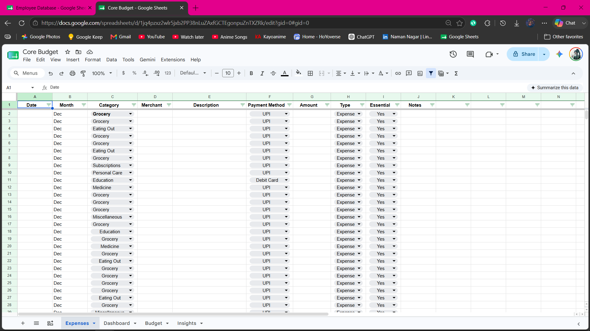
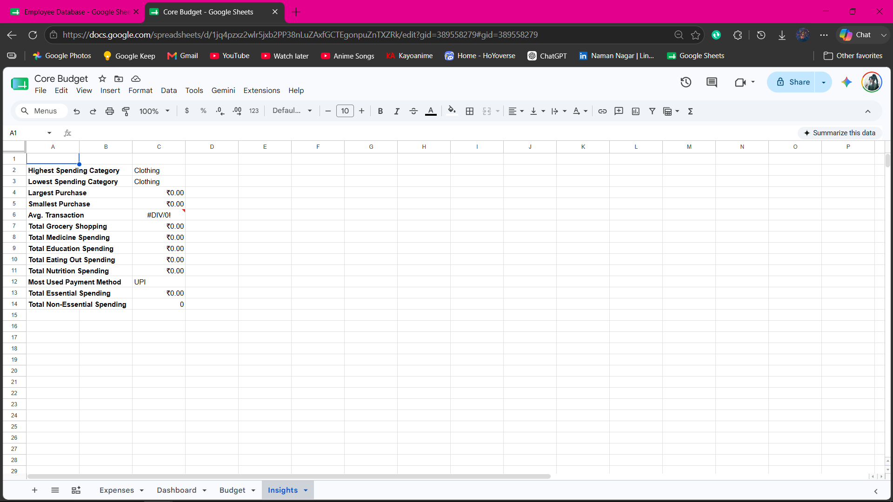
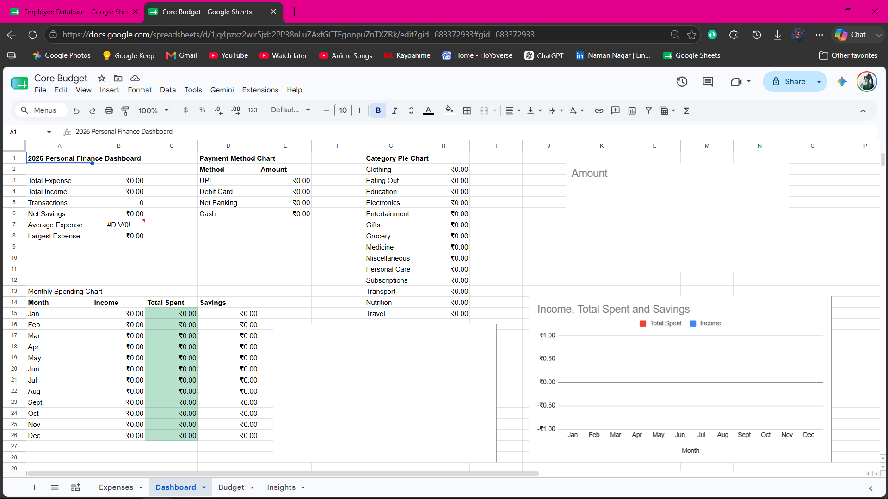

# Budget Template

A reusable Microsoft Excel budget tracker designed for recording expenses and monitoring spending through an interactive dashboard.

## Features

- Expense tracking
- Budget planning
- Dashboard
- Spending insights
- Category analysis
- Payment method analysis
- Monthly summaries
- Charts

## Excel Skills Used

- SUMIFS
- COUNTIFS
- Pivot Tables
- Pivot Charts
- Conditional Formatting
- Data Validation
- Lookup Functions

## Screenshots

### Dashboard

### Expense Entry

### Insights

### Charts

