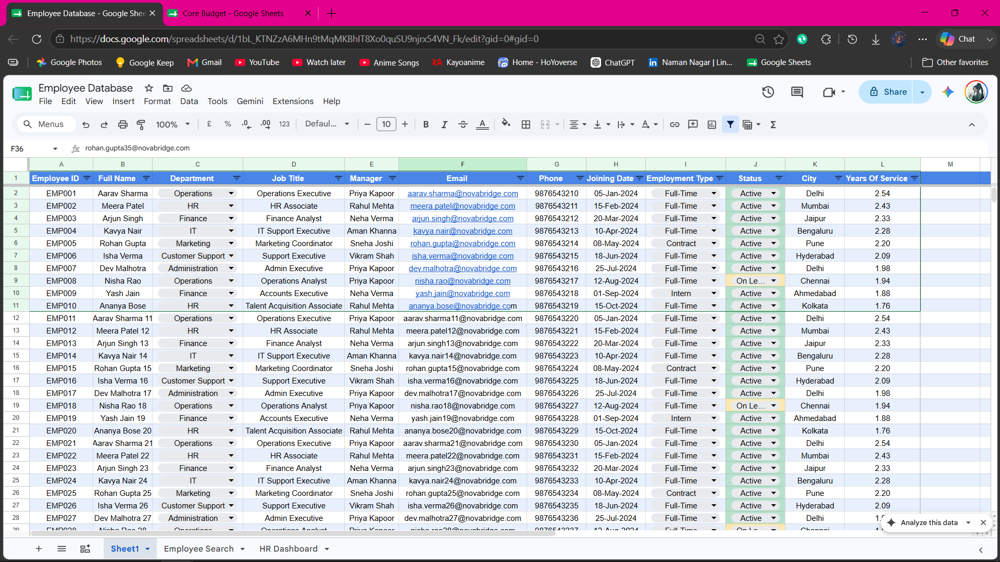
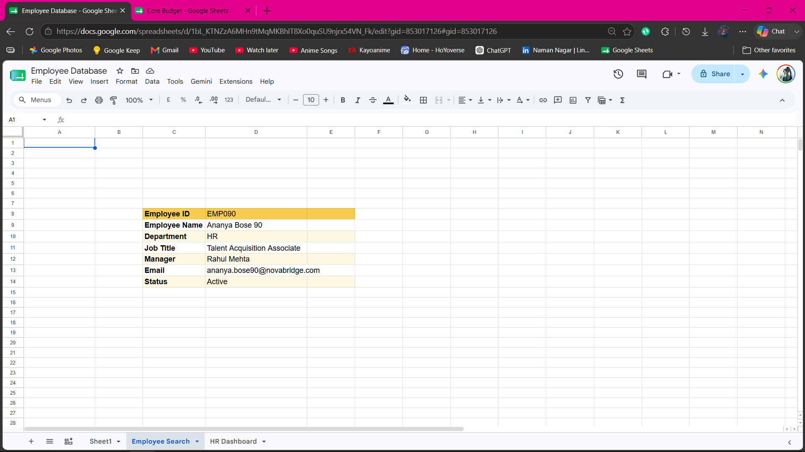
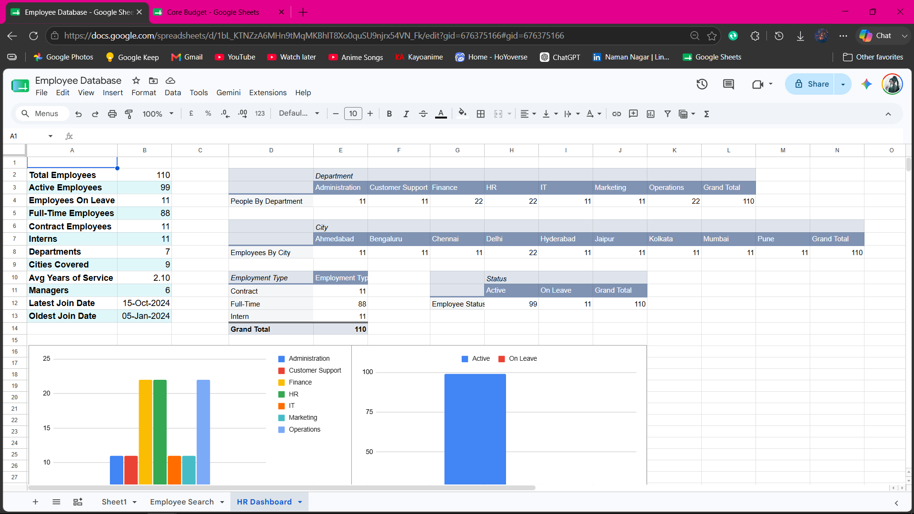
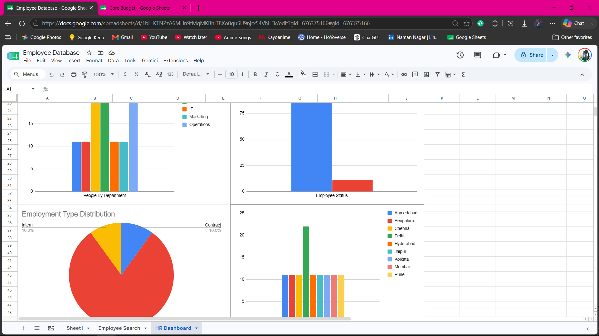

# Employee Database

A Microsoft Excel employee management project created to demonstrate practical spreadsheet skills used in HR and administrative roles.

## Features

- Employee database
- Employee search using XLOOKUP
- HR dashboard
- Department statistics
- Employee status summary
- Employment type distribution
- Charts
- Pivot Tables

## Excel Skills Used

- XLOOKUP
- COUNTIF
- COUNTIFS
- Pivot Tables
- Pivot Charts
- Conditional Formatting
- Data Validation
- Named Ranges

## Screenshots

### Employee Database

### Employee Search

### HR Dashboard

### Charts

